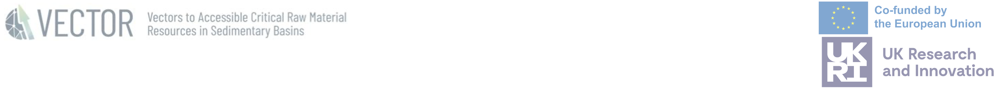

# Welcome to Squizz!

## What is Squizz?
**Squizz** is a prototype mapping application designed to support collaboration and communication among stakeholders from **research, industry, and local government**.  It provides a platform for exploring the complexity of mining in Europe from both social and environmental perspectives, enabling these diverse groups to engage in informed discussions and co-create sustainable strategies for mining projects.

## What does Squizz do?
Squizz uses machine learning to combine social and environmental from across the EU which can help users explore how these factors may impact potential mining projects. The result is a semi-quantitative indication of potential opportunities or conflicts – which is referred to as **impact tendencies**:

-	**Positive tendencies** suggest potential benefits (e.g., jobs, regional development). 
-	**Negative tendencies** suggest possible risks or tensions (e.g., negative environmental impact, social resistance).

The impact tendency values are colour-coded on a hexagon-based map of Europe, where each hexagon represents one region.

## The VECTOR Project

Europe set out its goals for decarbonization in the EU Green Deal. Achieving these targets will require more responsible use of, and a sharp increase in, the supply of critical raw materials.  To meet its demand in raw materials, the EU is currently reliant on imports and is therefore vulnerable to changes in the geopolitical landscape and supply chain interruptions. Complex social, environmental, and technical challenges need to be understood to explore the potential domestic sourcing of metals and minerals in the EU. The VECTOR project seeks to explore these challenges by bringing geosciences and social sciences together. VECTOR [seeks](https://vectorproject.eu/) to develop human-centred solutions for a socially acceptable, responsible, and sustainable supply of critical raw materials in Europe and thus contribute to achieving the Green Deal.

## Disclaimer

Impact tendencies and results are **not** predictions. Real-world impacts depend on specific project details, community engagement, and mitigation strategies. However, Squizz can support early-stage processes such as training, regional exploration or screening, by highlighting social and environmental considerations.

Before  continuing, please confirm that you are aware that Squizz:

1.	Does **not** advocate for or against any specific (current or proposed) mines.
2.	Does **not** identify regions as "appropriate" or "inappropriate" for mining. 
3.	Does **not** predict public acceptability or social licence to operate. 
4.	Is a research prototype and should be used with **caution**.

Please refer to the [help](.#/help) page for guidance on how Squizz works and how to use it.